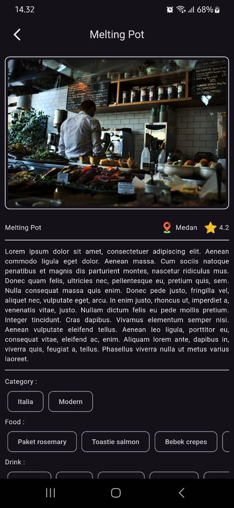
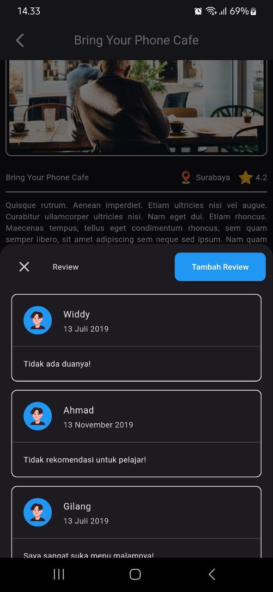
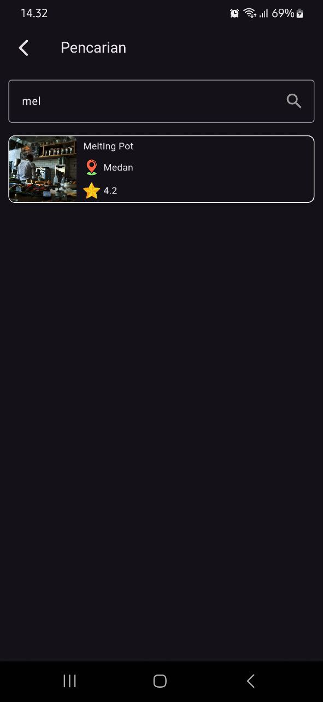
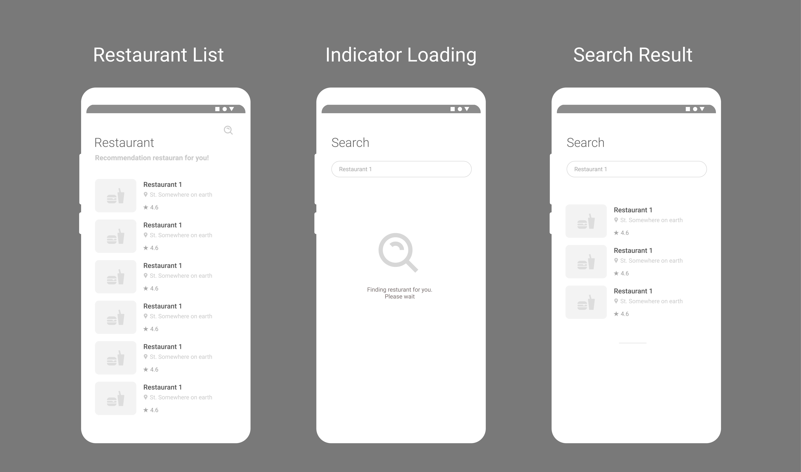

# 🍽️ Restaurant App

## 📝 Overview

Restaurant App is a mobile application developed as part of a certification project for Dicoding Indonesia. This app interacts with an API provided by Dicoding to showcase a list of restaurants, detailed information about each restaurant, and other related features. The project utilizes the Flutter framework along with the Provider state management library.

## ✨ Features

### 1. 📋 Daftar Restoran
- **Display Restaurants**: The app displays a list of restaurants with brief information fetched from the API.
- **Display Images**: Restaurant images are also fetched and displayed from the API.

### 2. 📄 Detail Restoran
- **Detailed Information**: When a restaurant item is tapped, the app shows detailed information including description, city, rating, food menu, and drink menu.
- **Display Images**: Restaurant images are fetched and displayed from the API.

### 3. 🔍 Pencarian Restoran
- **Search Functionality**: Users can search for restaurants by name or menu items.

### 4. ⏳ Loading Indicator
- **Loading State**: A loading indicator is shown while the app fetches data from the API.

### 5. ⚠️ Error Handling
- **User-Friendly Errors**: The app displays user-friendly error messages when accessed without an internet connection.

### 6. 🛠️ State Management
- **Provider**: The app uses the Provider library for state management to ensure smooth and efficient data handling.

### 7. ❤️ Favorite Restaurant
- **Add/Remove Favorite**: Users can add or remove restaurants from their favorite list using a local database.
- **Favorite List**: A dedicated page displays the user's favorite restaurants.
- **Favorite Detail Page**: Users can view the detailed page of a restaurant from their favorite list.

### 8. ⏰ Daily Reminder
- **Daily Reminder**: The app includes a setting to enable or disable daily reminders at 11:00 AM to show a random restaurant.
- **Reminder Setting**: The reminder can be toggled on or off from the settings page.

### 9. 🧪 Testing
- **JSON Parsing Test**: The app includes at least one test scenario to verify successful JSON parsing.

## 📸 Screenshots & Design

### 📱 Prototype Design & Layouts

#### Main Screenshots
<p align="center">
  
  
  
</p>

#### 📝 Design Wireframes



## 🚀 Getting Started

### 🛠️ Prerequisites

- Flutter SDK version: 3.4.3
- Dart version: 2.17.0 or higher

### 🧑‍💻 Installation

1. Clone the repository:
    ```bash
    git clone https://github.com/muuri19/Restaurant-App-Dicoding.git
    ```
2. Navigate to the project directory:
    ```bash
    cd Restaurant-App-Dicoding
    ```
3. Install the dependencies:
    ```bash
    flutter pub get
    ```

4. Run the application:
    ```bash
    flutter run
    ```

## 📝 Pubspec.yaml

Here are the key details from the `pubspec.yaml` file:

- **Version**: 1.0.0+1
- **Environment**: SDK: `>=3.4.3 <4.0.0`

### 📦 Dependencies

- `flutter`
- `cupertino_icons: ^1.0.6`
- `http: ^1.1.2`
- `d_method: ^0.2.6`
- `provider: ^6.1.2`
- `google_fonts: ^6.2.1`
- `loading_animation_widget: ^1.2.1`
- `cached_network_image: ^3.3.1`
- `logger: ^2.4.0`
- `sqflite: ^2.3.3+1`
- `shared_preferences: ^2.2.2`
- `flutter_local_notifications: ^16.1.0`
- `rxdart: ^0.27.7`
- `android_alarm_manager_plus: ^3.0.3`
- `intl: ^0.19.0`
- `device_info_plus: ^9.1.1`
- `permission_handler: ^11.0.1`

## 📜 License

This project is licensed under the MIT License - see the [LICENSE](LICENSE) file for details.

## 🙏 Acknowledgments

- Dicoding Indonesia for providing the API and project guidance.
- The Flutter community for continuous support and resources.
